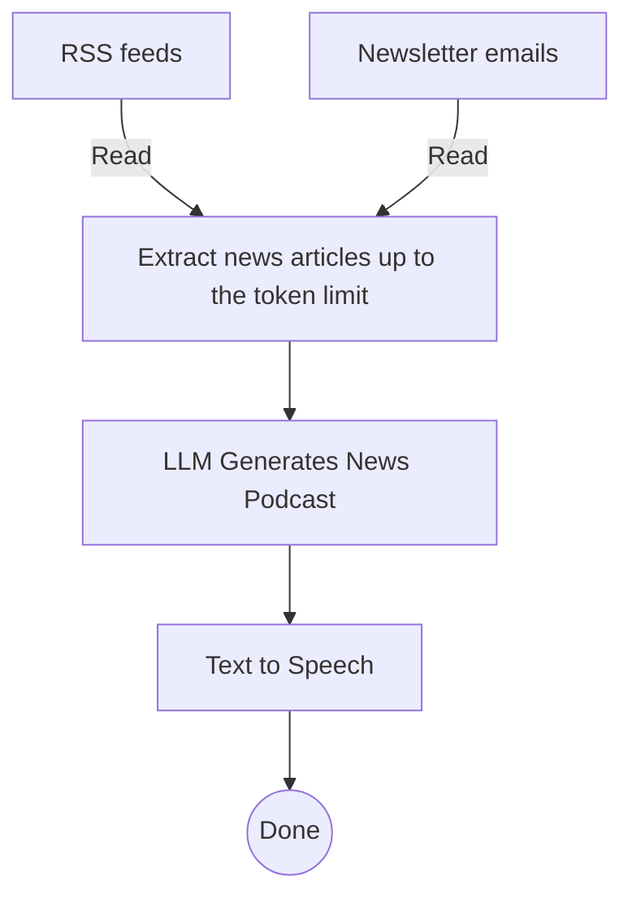
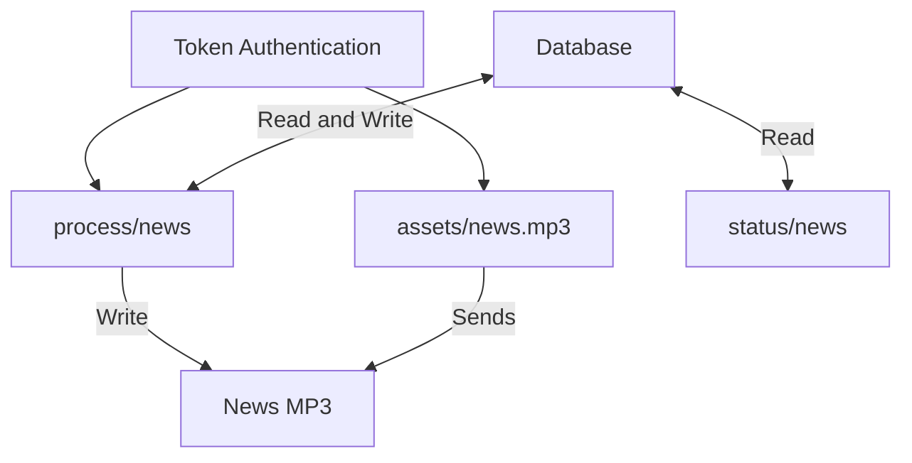

# Customised News Podcast
A web application or tasker task that turns newsletters and RSS feeds into a customised podcast tailored to my interests to spark my curiosity and thinking without leading me down rabbit holes so I can spend more time planning and less time getting informed.
## Problem Background
Keeping informed about the news and developments in my field of interest used to require ad-hoc methods, for instance, while my morning alarm was programmed to play a news podcast, it covered general news including areas that don't interest me like sports, and I had to look at summaries of AI research separately, which took time and was open ended enough that it could eat into my planning time in the morning.

So I decided to aggregate news from a variety of sources and turn it into an on demand podcast tailored to my interests and at a level of detail that balanced time, satisfying high-level curiosity, and giving me leads for more in depth learning.
### Design Requirements
- **Zero dollar budget**: meaning measures had to be taken to remain in the free-tier of APIs and hosting while trying to control for quality.
- **Low scale**: the solution only has to work for one person. This greatly simplified the development process.
- **Outputs**: a podcast customised to my interests from **recent** news that plays after I turn off my morning alarm or on demand.
	- **Timely**: only recent news.
	- **Relevant**: Includes news about developments in my field of research, and general news, but not on things I may not be interested in.
- **Rate-limited**: built in safety mechanisms to not breach rate-limits of news sources.
- **Fast enough**: should not take more than a few minutes to generate a podcast from start to finish.

## Solution Summary



### Extracting News Article Information
```
# Fetches RSS feeds from which news content is crawled and scraped
def getArticles():
    links = [
        "https://kill-the-newsletter.com/feeds/ge2j22syndlvy8v7b71q.xml",
        "https://www.business-standard.com/rss/markets-106.rss",
        "https://www.rnz.co.nz/rss/world.xml",
        "https://www.sciencedaily.com/rss/all.xml",
        "https://www.rnz.co.nz/rss/media-technology.xml",
        "https://www.rnz.co.nz/rss/political.xml",
        "https://www.rnz.co.nz/rss/business.xml",
        "https://www.rnz.co.nz/rss/country.xml",
        "https://www.rnz.co.nz/rss/national.xml",
        "https://www.livescience.com/feeds/all"]
    relevant_articles = []
    now_time = datetime.now()

    #Only request feeds within safe rate limits
    links = pruneLinksByAccessPolicy(links)
    #Get unique content published within 36 hours from each of the RSS feeds
    for link in links:
        #Get the feeds
        feed = feedparser.parse(link)
        #For each entry add it to relevant articles if it's unique and published within 36 hours
        for entry in feed.entries:
            timeArgs = entry.published_parsed
            published_time = datetime(timeArgs[0],timeArgs[1],timeArgs[2],timeArgs[3],timeArgs[4],timeArgs[5])
            #If it was published within 36 hours
            if (now_time - published_time).total_seconds() < 60*60*36:
                isUnique = True
                for article in relevant_articles:
                    #If the article is unique (the first of the same title within the articles to be used)
                    if entry.title == article.title:
                        isUnique = False
                        break
                if isUnique:relevant_articles.append(entry)
    # Return the recent and unique articles
    return relevant_articles
```

1. **Rate limiting**: Inspect rate limits to determine if it's safe to request information from the URL
```
#Ensures that urls with rate limits aren't spammed into DOS
def pruneLinksByAccessPolicy(links):
    now = (datetime.now() - datetime(1970,1,1)).total_seconds()
    new_links = []
    limits = []
    limits_str = ""
    with open("url_limiter.csv","r") as file:
        limits = file.read().split("\n")

        #For each link policy do policy evaluations. Use a more scalable version if you want this to be used by other people
        for i in range(0,len(links)):
            append_links = True
            for policy_raw in limits:
                policy = policy_raw.split(",")
                if len(policy) <= 1:continue

                #If the URL is identical then apply the policy: allow policy[2] requests per policy[1] minutes, with the counter of number of times being policy[3]
                if policy[0] == links[i]:
                    count = eval(policy[2]) - eval(policy[3])
                    last_time = eval(policy[4])
                    #If the range of time of the rate limited batch has past, then reset the counter, if there are requests still left in the batch then decrement the counter, else all requests have been used
                    if (now - last_time) / 60.0 > eval(policy[1]):
                        count = eval(policy[2]) - 1
                    elif count > 0:
                        count -= 1
                    else:
                        append_links = False

                    #Update the policy to incude the new count and time range if applicable, else log a rate limit and the policy will be identical to what it was
                    if append_links:
                        count_left = str(eval(policy[2]) - count)
                        limits_str += policy[0]+","+policy[1]+","+policy[2]+","+count_left+","
                        if count == eval(policy[2]) - 1: limits_str += str(now) + "\n"
                        else: limits_str += policy[4] + "\n"
                    else:
                        limits_str += policy_raw + "\n"
                        print("Removing "+links[i]+" from scrape list due to safety rate limit.")
                        print("Can scrape it again in "+str((eval(policy[1])) - (now - last_time) / 60.0)+" minutes")
                    break
            #If a request can be made without reaching the rate limit do so, else don't add it to the list of links to do the rest of.
            if append_links:
                new_links.append(links[i])
    # Write the updated url request limit policies to the policy file
    with open("url_limiter.csv","w+") as file:
        file.write(limits_str)
    # Return the links that can be requested within existing rate limit policies
    return new_links
```
2. **Fetch data**: If it's safe and we haven't reached the token limit for the news context to provide the LLM, request and extract information from the XML at that URL such as title and published date, but only save the ones published in the last 36 hours and the title is unique (to avoid crude duplicates).
3. **Extract content**: Extract the content of articles and newsletters using beautiful soup, if necessary crawling to the article website. Stored it in JSON format.
```
#Get news content from article website
def fetch_article_content(url):
    try:
        # Fetch the article webpage
        response = requests.get(url, timeout=10)
        response.raise_for_status()
        
        # Parse the HTML content
        soup = BeautifulSoup(response.text, 'html.parser')
        
        # Initialize an empty list to hold the formatted text
        content = []
        
        # Extract content while preserving headers, lists, and paragraphs
        for element in soup.find_all(['h1', 'h2', 'h3', 'h4', 'h5', 'h6', 'p', 'ul', 'ol']):
            if element.name.startswith('h'):  # Headers (h1-h6)
                level = int(element.name[1])  # Get the header level
                content.append(f"{'#' * level} {element.get_text(strip=True)}")
            elif element.name == 'p':  # Paragraphs
                content.append(element.get_text(strip=True))
            elif element.name == 'ul':  # Unordered lists
                for li in element.find_all('li'):
                    content.append(f"- {li.get_text(strip=True)}")
            elif element.name == 'ol':  # Ordered lists
                for i, li in enumerate(element.find_all('li'), start=1):
                    content.append(f"{i}. {li.get_text(strip=True)}")
        
        # Join all lines into a single string with double newlines between elements
        return "\n\n".join(content).strip()
    
    except Exception as e:
        print(f"Failed to fetch content from {url}: {e}")
        return "Content unavailable."
```
### LLM Generates News Podcast
The news articles were then added to a prompt for Mistral-7B Instruct v0.3 using HuggingFace's serverless inference API. The prompt was iterated on to attempt to improve the quality of the podcast using canonical form instructions (topical rails).
```
#Prompt a LLM to make a summary of the news based on my interests and the collected articles
def proompt(content, secret):
    word_limit = "750"
    character_limit = "4700"
    prompt = """Please create a script from the sources provided below that can be read through text to speech to that gives an overview of the news that:
- Is tailored for Patrick, a postgraduate student studying computer science currently on holiday in Gisborne with interests in:
	- Keeping up with developments in AI, machine learning, intelligent systems, molecular biotechnology, computational biology and related fields such as software engineering and genetics.
	- Knowing what's going on in the world including in economics, markets and industry, demographic trends, book news, the technology sector, world news, politics, and New Zealand news.
- Prioritise articles and the amount of detail by relevancy to keep the script within the word limit of """+word_limit+""", and a character limit of """+character_limit+""" (whichever comes first), by covering Patrick's direct interests more expansively where available, giving summaries relevant news, and by discarding news that's irrelevant to their interests or circumstances (for instance, sports, movies, media).
- Rearrange and synergise information where appropriate to give a cohesive feel to each section of the news, maintain specificity, and avoid repetitions.
- Keep the preamble or introduction part of the script short like a greeting and that this is news for the specific date.
- Give the published date and news source for each article cited where available.
- Keep a natural flow of language - avoid introducing characters to the script that could interrupt the natural flow of language such as asterisks and URLs.
- Divide the news into two sections: research and news. There's no need to include specific sub-sections on interests where there isn't any direct news on them.
- Please don't repeat articles or go over the maximum amount of words for the script( """+word_limit+"""). Include no more than 15 'articles' (after combination). 
Please see the news articles and newsfeed email contents below, which might help in constructing the script:\n"""
    print("Prompt length: "+str(len(prompt)+len(content)))
    client = InferenceClient(
    "mistralai/Mistral-7B-Instruct-v0.3",
    token=secret,
    )
    try:
        return client.text_generation(prompt+content, max_new_tokens=1170)
    except err:
        print("Error generating overview: "+err)
    return None
```
#### Current Prompt
```
Please create a script from the sources provided below that can be read through text to speech to that gives an overview of the news that:
- Is tailored for Patrick, a postgraduate student studying computer science currently on holiday in Gisborne with interests in:
	- Keeping up with developments in AI, machine learning, intelligent systems, molecular biotechnology, computational biology and related fields such as software engineering and genetics.
	- Knowing what's going on in the world including in economics, markets and industry, demographic trends, book news, the technology sector, world news, politics, and New Zealand news.
- Prioritise articles and the amount of detail by relevancy to keep the script within the word limit of """+word_limit+""", and a character limit of """+character_limit+""" (whichever comes first), by covering Patrick's direct interests more expansively where available, giving summaries relevant news, and by discarding news that's irrelevant to their interests or circumstances (for instance, sports, movies, media).
- Rearrange and synergise information where appropriate to give a cohesive feel to each section of the news, maintain specificity, and avoid repetitions.
- Keep the preamble or introduction part of the script short like a greeting and that this is news for the specific date.
- Give the published date and news source for each article cited where available.
- Keep a natural flow of language - avoid introducing characters to the script that could interrupt the natural flow of language such as asterisks and URLs.
- Divide the news into two sections: research and news. There's no need to include specific sub-sections on interests where there isn't any direct news on them.
- Please don't repeat articles or go over the maximum amount of words for the script( """+word_limit+"""). Include no more than 15 'articles' (after combination). 
Please see the news articles and newsfeed email contents below, which might help in constructing the script:
```
#### Why no CoT, Reflection, N-Shot etc
The focus of prompt engineering for the initial news podcast generator attempts to maximise the amount of news the LLM can select from (hence no N-shot) in a single inference (hence no reflection) without additional code (hence no Chain of thought, even if implicit CoT could have been used with an instruction to think through selection and organisation of articles then put the actual script in triple quotes for easy extraction).
#### Why No Expert Prompting?
Deployment issues came before further prompt refinement. Adding `You are an award winning journalist tasked with creating a script...` might help but I'm yet to test differences in performence
#### Previous Prompt Iterations and Their Issues
### Text To Speech
#### Python Version
The resulting podcast script is then converted to audio in a MP3 format using Google's TTS API with en-US-Wavenet-F and saved as a MP3 file for later use.
```
def tts(text,out_src):
    credentials = service_account.Credentials.from_service_account_file(
    r"SOMEWHAT/SECURE/DIR/TO/CREDENTIALS"
    )
    
    client = texttospeech.TextToSpeechClient(credentials=credentials)

    # Set the text input
    text_input = texttospeech.SynthesisInput(text=text)

    # Build the voice request
    voice = texttospeech.VoiceSelectionParams(
        language_code="en-US",
        name="en-US-Wavenet-F"
    )

    # Select the type of audio file you want returned
    audio_config = texttospeech.AudioConfig(
        audio_encoding=texttospeech.AudioEncoding.MP3
    )

    # Perform the text-to-speech request
    response = client.synthesize_speech(
        input=text_input,
        voice=voice,
        audio_config=audio_config
    )

    # Save the response as an audio file
    with open(out_src+".mp3", "wb") as out:
        out.write(response.audio_content)
        print('Audio content written to "'+out_src+'.mp3"')
```
#### JavaScript Version
Due to the limitations of JS scripts running in Tasker that make using OAuth complicated, the script was converted to audio in real-time using pre-existing TTS functions in Tasker. This decision was made to save time.
### Deployment
#### Flask Server
To run the solution as a API that my morning alarm could interact with I made a simple Flask server designed to function for only one user (adjustments to make it multi-user include a database of token-hashes for authentication and either prefix's for a Redis key (or a 'status') for each unique user, or porting to use a relational database instead.).


- **Token Authentication**: Simply matches the raw string with a 'secret' and the current day rather than a match to ensure that only I'm using it.
	- **Why so low security**: attackers would have to discover the URL first, which isn't published, and circumvent Cloudflare tunnel security measures. Since the secret isn't published it won't be reverse engineered unless they crack into the RPi I'm hosting the program on (who would put in that amount of effort for so little reward?). So, I saved myself some time (though I'd never be so relaxed with other people's data).
- **assets/news**: authenticates the request, then returns with the news.MP3
- **process/news**: cycles between states with differing behaviour:
	- "sent" or uninitialized: sets the state to "loading" and starts a thread to process the news using the solution, either resulting in the state changing to "loaded" or "failed". Returns the JSON status as "starting"
	- "loading": when requests come to this route and the status is "loading" it returns a JSON status "loading", indicating that the podcast is being generated 
	- "failed": when a request comes to this route and the status is "failed" is does the same thing as "sent" but returns the JSON status "failed, trying again" along with a 500 code
	- "loaded": sets the status to "sent", returns a JSON status "loaded" along with a URL to the assets/news page.
```
@app.route("/process/news", methods=['POST'])
def getNews():
    if validateToken():
        if not r.exists("news") or r.get("news").decode('utf-8') == "sent":
            r.set("news","loading")
            thread = threading.Thread(target=processNews)
            thread.start()
            return {"status":"starting"}
        elif r.get("news").decode('utf-8') == "loaded":
            r.set("news","sent")
            news_url = request.base_url+"assets/news.mp3"
            return {"status":"loaded","url":news_url}
        elif r.get("news").decode('utf-8') == "loading":
            return {"status":"loading"}
        elif r.get("news").decode('utf-8') == "failed":
            r.set("news","loading")
            thread = threading.Thread(target=processNews)
            thread.start()
            return {"status":"failed, trying again"}, 500
    else:
        abort(401)
```
- **status/news**: returns the current status of the news generator (sent, loading, failed or loaded) without affecting it.
#### Tasker JavaScript Action
To run the solution on my phone I first made a rough port from Python to JavaScript using Claude, then made adjustments so that the application ran smoothly in a testing environment on my laptop as a website. Then I adjusted the JavaScript to work with Tasker functions instead of Browser ones and made work arounds for the older version of JS that Tasker uses (this stage is currently in progress).
## Impact and Limitations
### Podcast Quality Vs Time
- Smaller models like mistral-7B-instruct-0.3v have a more limited instruction following ability which creates a trade-off between CoT within a single inference and keeping the podcast within the time-limit. In addition the number of steps increases the latency between podcast request and delivery.
- Future versions could use scheduled podcast generation (for instance half an hour before I'm scheduled to wake up), limiting up-to-date-ness but allowing for longer processing times. Multiple inference could be used to filter from each news source according to interests, to create a more curated set of data to draft a podcast from with implicit CoT and multiple reflectionrounds, allowing for better performance out of the smaller models for which free-inference is available. This could be done using the free-tier of the Mistral API which has a 1 request per second rate limit.
### Scalability
See the deployment section for how the flask server could be adapted to work for multiple users. In addition hashing of tokens would be used, as well as additional flask routes for CRUD operations on the newsfeeds for each user. Additional steps for content moderation and ethical scraping would be required as it's not guaranteed that the sources users provide would be appropriate.
Of course at larger scales a single Flask server won't suffice. Instead load balanced routing to multiple virtual machines or serverless scripts could be used and a cloud based database but at this point, and the use of key management services. But at this point the number of changes would far outnumber the original pieces of code.