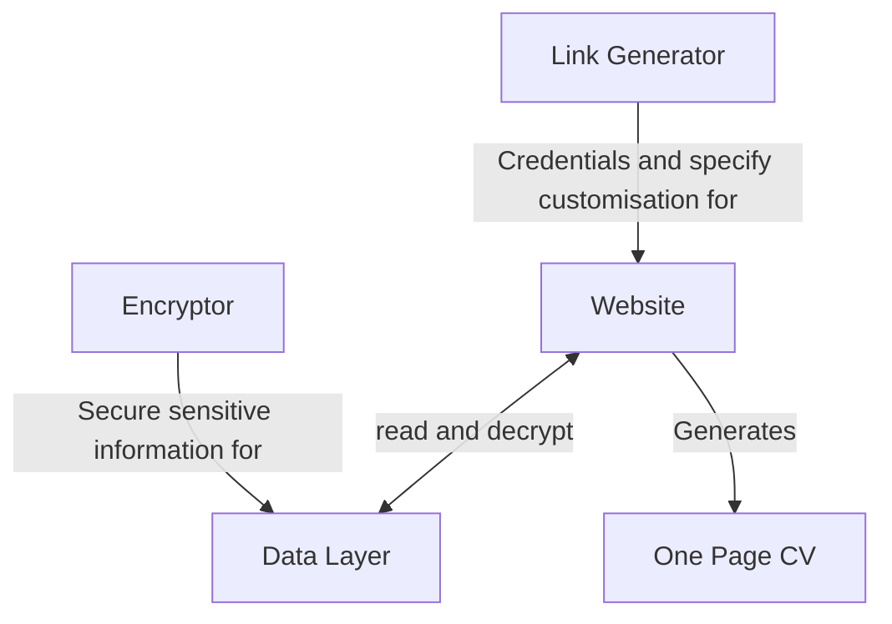
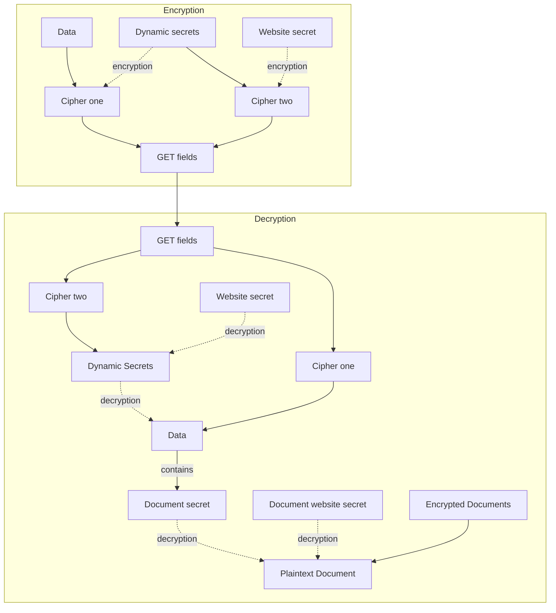
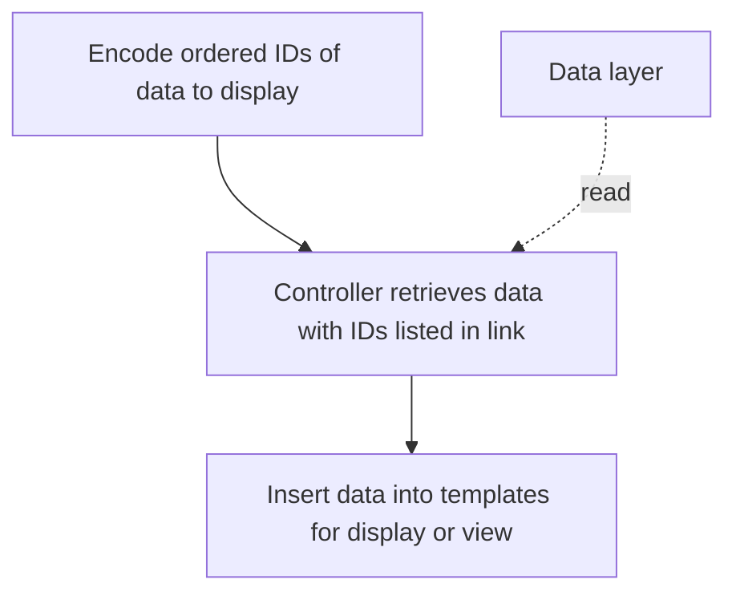

# Electronic-CV
An interactive and information rich website with access control for sensitive data that customises itself to display relevant information to people who may hire me or use my services.
## Problem Statement
Taking a long time to customise job applications that blend in with the crowd isn’t an efficient way to seek a job. HR teams filter job applications based on concise information that can be summarised in a single page CV, with additional pages making their jobs harder. But subsequent rounds require more information. Traditionally, this might require phone calls and interviews, which are cumbersome. This approach limiting the throughput of application evaluation, and requires the hiring process to accommodate the gap in information sources across the spectrum of effort and information depth.

![[../images/hiring_process_bottlenecks.png]]

E-portfolios are rich-sources of information that are easier to access than the candidates themselves, making them suitable for informing the hiring decisions between the first round of CV filtering and interviews. They can contain all the information of a CV, and can be customised and translated into resumes programmatically.

### Requirements
- **Trustable Domain**: If hiring staff don’t visit the website because of its domain name, the benefits of having an e-portfolio can’t be realised.
- **Zero-budget**: because of financial uncertainty.
- **Easily customisable**: the CV and links to the e-portfolio must tailor information to the job-posting, and the customisation process must be efficient enough to support a high throughput application strategy, and deep enough to support a highly targeted application strategy.
- **Secure**: the solution shouldn't expose exploitable information to people who don't need it.
- **Good UX**: visually appealing, informationally balanced and responsive design fit for any screen hiring staff might view the site from.
- **Information rich**: The solution should contain any information a hirer or customer might need to decide to use my services or hire me.
- **Maintainable**: The solution should be fit for constant adaptation and changes to data, logic, and view.
## Design
### Trade-off Choices
1. Use GitHub-pages for trusted and free-hosting with built-in version control. However, GitHub hosting doesn’t support server-side code. This severely limits future scalability. But if there is enough demand for my electronic CV to require a more scalable solution, then I can afford to have a proper MVC web-application with a scalable database.
2. Not all use cases for the website require all the information I can provide, so retrieve information dynamically from a data layer to improve performance at the cost of simplicity. 
	- The number of data elements and users is small, therefore JSON files will suffice.
### Overall Architecture

#### Link Generator ::LG
Use GET fields to transfer encrypted sensitive information that often changes to the website (such as work location and cryptographic secrets), as well as non-sensitive customisation information.
#### Website ::CE
Use the customisation specifications and sensitive information to generate an interactive website that can convert into a CV format, accessing more data heavy elements from the data layer.
#### One Page CV ::CV
Created by printing the website or by pressing a CV button.
#### Data Layer ::DATA
Separate structured data from the website to improve maintenance through separation of concerns and improve performance, as explained in the choices section of this report. Some documents here are encrypted.
#### Encryptor ::ENCRYPTOR
Encrypt data heavy, non-transient sensitive information to enable access control for that information (for instance, specifics about course grade). Then store this information in the data layer.
### Security

The decryption of encrypted files and the secrets in the GET fields requires both a secret only accessible by the website and an encrypted secret specific to that link. The extra encryption step ensures that an intercepted HTTP request cannot be decrypted using only information about decrypting another HTTP request. In addition, it increases the difficulty of accessing encrypted documents or other sensitive data without an authentic link.

Information is encrypted with GCM AES-256.
#### Some Of The Limitations
- The website's secret changes every month. The dynamic secret is unique to each link. This means that interceptors could reuse the intercepted GET field within that time-span in a replay attack.
- Dynamic secret generation depends on robust random number generation.
### Customisation

The e-portfolio is customised by including the IDs of the skills to emphasise in order within the link to the website. The IDs are then used to retrieve the relevant data and display it through templates on the view of the website, similar to a controller layer in MVC architecture.
### Aesthetics and UX
- **Colour pallet selection**: Follows a dichromatic colour scheme combined with varying lightness-darkness levels, ensuring contrast between text and background independent of hue and saturation (especially important for colour blind people and readability).
- **Blindness accessibility**: The HTML structure uses semantic elements, and I plan on adding alt values for each image to ensure it remains accessible to vision-impaired users.
- **Responsive design**: Different styling depending on the dimensions of the screen with a single column flow for phones, and a two-column layout for desktops, as well as the use of relative size units to maintain layout readability and integrity at different display sizes in between.
- **Loading splash with animation**: A splash screen displays while HTML is being populated with data by the JS controller methods.
-**Indicating interactive elements**: Achieved through using underline and the secondary colour.