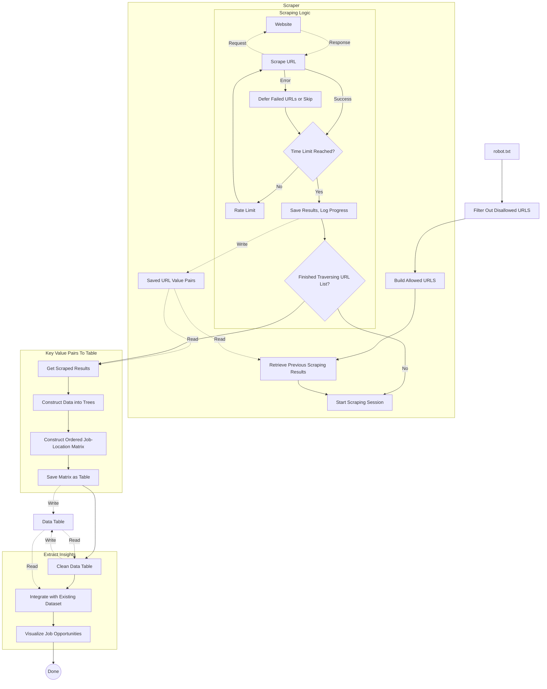

# Web Scraping Relevant Jobs By Location
![[../images/project_result.png]]
Web-scraped over 2000 web pages to calculate which cities in NZ have better opportunities for someone of my background using Selenium with Python.
## Problem Background
I planned on using job posting data to aid in deciding where I would relocate for the time between February of 2025 and my Master's studies starting in July. Using overall job posting data for a small number of locations gives a limited (to regions of NZ) and inaccurate (all job postings, not just the ones I qualified for) picture of job opportunities, and manually collecting data on categories of jobs for every location in New Zealand would be time consuming.![[../images/job_seekers_vs_jobs.png]] So instead, I decided to scrape a well known job posting website in New Zealand for the data.
- Why web-scraping instead of a job posting API: The API for the job-website is for commercial uses only, while this project is for personal use.
### Design Requirements
- Rate limited and compliant: the solution mustn't scrape disallowed URLs or exceed rate limits.
- Fault tolerant: the solution needed to be interruptible and not lose scraping process, and handle visiting web pages without the expected data or structure.
- Outputs: the solution needed to output a table of each job category against each location with locations and categories ordered by subtype (e.g. IT/software development, and IT/network engineering should be closer to each other than IT and Customer Service jobs)
- Time constraint: the data needed to be ready within four days - the deadline for my relocation decision.
## Solution Summary

#### Data Filtering
Allowed URLs were retrieved from the website's robot.txt file and sorted into either job paths or location paths for further processing. The job categories were then further filtered to those which I could meet the requirements for. Over several iterations the list of locations was pruned as I gained more information about which cities and towns ranked well in my decision matrix by other factors such as rent and proximity to rural job opportunities. Results from the partial scraping of previous iterations were built on rather than starting from scratch.
#### Building Allowed URLs
The website's paths to location and job information followed the format {job path}/{location path}. This allowed me to combine the two path components to form a list of URLs to scrape rather than crawl the website.

```
def getURLs(root):
    pre = []
    with open("selected_sources/job_types.txt","r") as file:
        pre = file.read().split("\n")
    post = []
    with open("selected_sources/regions.txt","r") as file:
        post = file.read().split("\n")
    total_urls = []
    for url in pre:
        actual_url = url.split(",")[0].strip()
        if actual_url != "":
            total_urls.append(root + actual_url)
    for dir_ in post:
        if "*" in dir_:
            for prefix in pre:
                actual_prefix = prefix.split(",")[0].strip()
                if actual_prefix != "":
                    modded_dir = dir_.replace("*",actual_prefix)
                    total_urls.append(root + modded_dir)
        else:
            total_urls.append(root+dir_)
    return total_urls
```
#### Web Scraping
##### Hardware Setup
A raspberry Pi was set up to run the scraping using a Chromium web driver with settings configured to reduce the computational load to both improve performance and work within the RPi's constrained power.
```
    options = Options()
    options.add_argument("--headless")
    options.add_argument("--disable-gpu")
    options.add_argument("--no-sandbox")
    options.add_argument("--disable-dev-shm-usage")
    
    prefs = {"profile.managed_default_content_settings.images":2,
    "profile.managed_default_content_settings.stylesheets":2}
    options.add_experimental_option("prefs",prefs)
    
    service = Service("/usr/bin/chromedriver")
    driver = webdriver.Chrome(options=options,service=service)
```
##### Scraping
Achieved by simply traversing through the list of URLs and extracting the number of jobs from each page as displayed in a element with a unique class name.
```
def scrapeURL(driver,url):
    driver.get(url)
    count_text = driver.find_element(By.CLASS_NAME, "tm-search-header-result-count__heading").get_attribute('innerHTML')
    size = -1
    for word in count_text.split(" "):
        if word.isdigit():
            size = int(word)
            break
    if size == -1:
        raise Exception("Size at "+url+" not found")
    return size
```
##### Rate Limiting and Failure Tolerance
###### Tolerating Scraping Failures
In the event that a URL couldn't be scraped, an exception was thrown and depending on the iteration of the solution the URL would either be put at the end of the URL queue or skipped.
```
            try:
                result = scrapeURL(driver,selected_url)
                results[selected_url] = result
            except:
                #print("Skipping "+selected_url)
                urls.append(selected_url)
```
###### Rate Limiting
Occurred between each scrape (three to twelve seconds) and each scraping session (one to three minutes) to limit interruptions (imitating a human with random delays) and comply with scraping policy.
###### Tolerating Larger Spans of Scraping Failures or Interruptions
Every five to ten minutes (depending on the solution version) scraping sessions would pause and the results would be saved, followed by a random delay before starting another session. This provided intervals in which the program could be safely terminated without losing progress as well as serving to rate limit and reduce the chances of larger blocks of scraping failures or delays from continuing.
 `if time.time() - start_time >= timelimit_seconds:break`
Results were saved in a csv format in URL, Job-posting pairs.
#### Data Processing
The results of the web scraping were stored in key value pairs in a CSV file and needed to be transformed into a table with jobs as rows and locations as columns. Critically the labels needed to be ordered (e.g. IT/software development, and IT/network engineering should be closer to each other than IT and Customer Service jobs). To do this I constructed a job and location tree with each directory in a path as a node, then used a depth first search of both to create ordered intersections between the trees to transform it into a matrix that could be copied cell by cell into a CSV table.
##### Tree Construction
Because the paths contained the implied structure of the tree I could construct the job tree and location tree in a top down rather than bottom up fashion. Because the size of the tree was relatively small runtime wasn't an issue.

Tree construction parts of the LabelTree Class:
```
    def __init__(self,label:str="",isJob=True,parent = None):
        self.type_ = TreeType.JOB if isJob else TreeType.LOCATION
        self.num_children = 0
        self.parent = parent
        label_parts = label.split("/")
        self.label = label_parts[0]
        self.children = {}
        if len(label_parts) > 1: self.addChild('/'.join(label_parts[1:]))
    def addChild(self, child_label: str):
        child_parts = child_label.split("/")
        head = child_parts[0]
        if not head in self.children: self.children[head] = LabelTree(child_label, self.isJob(),self)
        elif len(child_parts) > 1:self.children[head].addChild('/'.join(child_parts[1:]))
        self.num_children+=1
```
##### Matrix Construction
1. Construct the row and column labels with independent depth first searches
```
        print("labelling rows")
        self.step = 0
        self.depthFirstSearch(self.jobs)
        #Label the columns as locations
        print("labelling columns")
        self.step = 1
        self.depthFirstSearch(self.location)
```
2. Perform a depth first search on the location labels where at each step a depth first search on job labels was performed to enumerate the intersection between the two label categories in the correct order.
```
                #If tree is a job that means adding the cell
                if tree.isJob():
                    hypothesis = tree.getFullLabel()+","+self.curr_location
                    result = self.matrix[self.curr_row][0]+","+self.matrix[0][self.curr_col]
                    if hypothesis != result:
                        print(str(self.curr_row)+","+str(self.curr_col)+"=")
                        print(hypothesis)
                        print(result)
                        
                    #Match result, requiring the label from the current 
                    result_value = str(self.getValue(tree.getFullLabel(),self.curr_location))
                    if result_value == "-1":result_value = ""
                    #Insert result and go to next row
                    if result_value != -1:
                        if len(self.matrix[self.curr_row]) > self.curr_col: self.matrix[self.curr_row][self.curr_col] = result_value
                        elif len(self.matrix[self.curr_row]) == self.curr_col:self.matrix[self.curr_row].append(result_value)
                        elif self.cols_num > self.curr_col:
                            while len(self.matrix[self.curr_row]) < self.curr_col:
                                self.matrix[self.curr_row].append("")
                            self.matrix[self.curr_row].append(result_value)
                        else:
                            print("Tried to update non existent cell:"+str(self.curr_row)+","+str(self.curr_col)+", meaning that the traversal algorithm is broken")
                            row_name = tree.getFullLabel()
                            print("With this value "+tree.getFullLabel())
                            for i in range(0,len(self.matrix)):
                                if row_name in self.matrix[i][0]:print("which is row "+str(i))
                            raise Exception("Blah!")
                    self.curr_row += 1
                #If tree is a location that means traversing the jobs
                else:
                    self.curr_row = 1
                    self.curr_location = tree.getFullLabel()
                    self.depthFirstSearch(self.jobs)
                    self.curr_col += 1
```
3. Retrieve the value corresponding to the composite path of the job and add it as the cell value at the coordinate of the intersection of the two labels.
```
    def getValue(self, job_name,location_name) -> int:
        key = location_name
        if location_name == "":key = job_name
        elif job_name != "":key = job_name+"/"+location_name
        key = "https://www.trademe.co.nz/a/jobs/" + key
        if key in self.results:return self.results[key]
        return -1
```
##### Depth First Search
Used the standard non-recursive method. Action at each stage was delineated by the type of tree and the "stage" property of the "Matrifier" class
- Stage one: labels
- Stage two: cell values
```
    def depthFirstSearch(self, root:LabelTree):
        if root is None:return

        stack = Stack()
        stack.push(root)

        while not stack.isEmpty():
            current = stack.pop()
            self.act(current)
            children = current.getChildrenTrees()
            children.reverse()
            for child in children:
                if child == current:
                    print(str(children[0].getFullLabel()))
                    raise Exception("Adding self to list again, that is "+child.getFullLabel()+"=="+current.getFullLabel())
                stack.push(child)
```
#### Extracting Insights
##### Cleaning Data
Simply removed rows and columns where no values were obtained
##### Integrate with Existing Dataset
1. Calculated the number of jobs I qualified for at each viable location
2. Calculated the estimated number of job seekers per job I qualified for (assumes everyone is looking for the jobs I am and not the ones I don't qualify for, which is roughly equivalent to assuming everyone is low-skill since the proportion of jobs that are in software development is insignificant).
3. Add this to the existing data which included job seekers per total number of jobs in each location I was interested in at the time.
##### Visualise Job Opportunities
Using a scatterplot of seekers per job and seekers per eligible job over the unemployment rate in each location (assumes that most undocumented frictional unemployment is insignificant) using matplotlib.

Removed outliers assuming normal distributions over data before constructing regressions with sci-kit learn.

This stage was done over a few iterations with Claude since I'm still not familiar with these libraries.
```
import pandas as pd
import matplotlib.pyplot as plt
import numpy as np
from sklearn.linear_model import LinearRegression
from sklearn.metrics import r2_score

# Data preparation
data = {
    "Location": ["Invercargil", "Dunedin", "Westport", "Christchurch", "Hamilton", 
                 "Auckland", "Ashburton", "Nelson", "Masterton", "Palmerston North", 
                 "Gisborne", "Tauranga"],
    "Unemployment Rate": [3.9, 4.6, 3.0, 4.9, 7.3, 4.7, 3.3, 3.7, 3.9, 4.4, 4.1, 4.3],
    "Seekers per Job": [11.60289, 13.01154, 8.11512, 15.16491, 21.86756, 56.04538, 
                        4.7586, 10.02132, 8.85828, 11.40449, 9.12852, 12.60483],
    "Seekers per Eligible Job": [85.08786, 31.30135, 3.1212, 458.60773, 36.61544, 
                                88.69613, 88.50996, 20.04265, 21.96854, 31.51239, 
                                31.5081, 716.37427]
}

df = pd.DataFrame(data)

# Define thresholds for outlier removal
seekers_job_threshold = 30  # Remove "Seekers per Job" > 30
eligible_job_threshold = 200  # Remove "Seekers per Eligible Job" > 200

# Filter out the outliers for regression calculation
df_filtered1 = df[
    (df["Seekers per Job"] <= seekers_job_threshold) &
    (df["Location"] != "Hamilton")
]

df_filtered2 = df[
    (df["Seekers per Eligible Job"] <= eligible_job_threshold) &
    (df["Location"] != "Hamilton")
]

# Create the plot
fig, ax1 = plt.subplots(figsize=(12, 7))

# Primary y-axis for Seekers per Job
ax1.scatter(df["Unemployment Rate"], df["Seekers per Job"], color='blue', label="Seekers per Job", alpha=0.7)
for i, location in enumerate(df["Location"]):
    ax1.text(df["Unemployment Rate"][i], df["Seekers per Job"][i], location, fontsize=9, color='blue', alpha=0.8)
ax1.set_xlabel("Unemployment Rate (%)", fontsize=12)
ax1.set_ylabel("Seekers per Job", color='blue', fontsize=12)
ax1.tick_params(axis='y', labelcolor='blue')

# Secondary y-axis for Seekers per Eligible Job
ax2 = ax1.twinx()
ax2.scatter(df["Unemployment Rate"], df["Seekers per Eligible Job"], color='red', label="Seekers per Eligible Job", alpha=0.7)
for i, location in enumerate(df["Location"]):
    ax2.text(df["Unemployment Rate"][i], df["Seekers per Eligible Job"][i], location, fontsize=9, color='red', alpha=0.8)
ax2.set_ylabel("Seekers per Eligible Job", color='red', fontsize=12)
ax2.tick_params(axis='y', labelcolor='red')

# Regression for Seekers per Job (excluding outliers)
x1_filtered = np.array(df_filtered1["Unemployment Rate"]).reshape(-1, 1)
y1_filtered = np.array(df_filtered1["Seekers per Job"])
model1 = LinearRegression()
model1.fit(x1_filtered, y1_filtered)

# Create prediction line only for the filtered range
x1_range = np.linspace(df_filtered1["Unemployment Rate"].min(), 
                      df_filtered1["Unemployment Rate"].max(), 100).reshape(-1, 1)
y1_pred = model1.predict(x1_range)
r2_1 = r2_score(y1_filtered, model1.predict(x1_filtered))
ax1.plot(x1_range, y1_pred, color='blue', linestyle='--', 
         label=f"Regression (Seekers per Job) [R²={r2_1:.2f}]")

# Regression for Seekers per Eligible Job (excluding outliers)
x2_filtered = np.array(df_filtered2["Unemployment Rate"]).reshape(-1, 1)
y2_filtered = np.array(df_filtered2["Seekers per Eligible Job"])
model2 = LinearRegression()
model2.fit(x2_filtered, y2_filtered)

# Create prediction line only for the filtered range
x2_range = np.linspace(df_filtered2["Unemployment Rate"].min(), 
                      df_filtered2["Unemployment Rate"].max(), 100).reshape(-1, 1)
y2_pred = model2.predict(x2_range)
r2_2 = r2_score(y2_filtered, model2.predict(x2_filtered))
ax2.plot(x2_range, y2_pred, color='red', linestyle='--', 
         label=f"Regression (Seekers per Eligible Job) [R²={r2_2:.2f}]")

# Title and legend
plt.title("Scatterplot of Unemployment Rate vs Seekers per Job and Eligible Job with Regression (Excluding Outliers)", 
          fontsize=14)
fig.tight_layout()
ax1.legend(loc='upper left', fontsize=10)
ax2.legend(loc='upper right', fontsize=10)
plt.grid(alpha=0.3)

plt.show()
```
![[../images/web_thumb.png]]
## Impact and Evaluation
### Outcome
Over two thousand web-pages were successfully scraped. The results demonstrated differences between total job postings and ones that I would be competitive in, especially within my current city of Christchurch. This allowed me to eliminate additional location options to arrive at a choice of town/city to relocate to.

- Pages scraped: 2294
- Scrape success rate: 99.17%
### Limitations and Room For Improvement
- Speed: the choice of a low rate-limit and the use of a RPi to run the solution excluded the possibility of using multi-threading to increase the speed of the data scraping. Scraping over all solution iterations took a total of ten runtime hours due to web-page loading speeds and the self-imposed rate limits. Even with optimisations web-pages took longer to load on the RPi than my laptop.
- Breadth: over several iterations the scope of the data scraping was limited to exclude locations that weren't viable for relocation. This reduced the scope and so reusability of the dataset.
- Using job categories as a proxy for job eligibility: while necessary because of the scraping rules of the job posting website, a more accurate assessment would have been possible through using LLMs to compare the requirements or titles of each job posting to my skills.
- Matrifier coupling: The use of a action method of the class instead of passing it as an argument, along with the use of a stage property reduces the reusability and maintainability of the depth first search method and the matrifier class through reduced orthogonality. 
- Data processing: a functional approach to the processing of lists might have been faster to code, more readable and performed better (though it made no detectable difference). I should learn and use NumPy and Pandas.